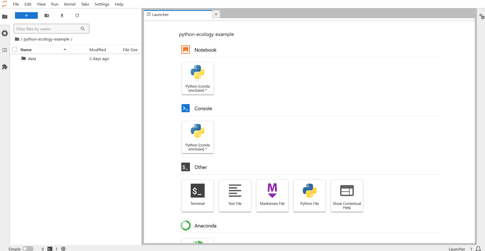

::::::::::::::::::::::::::::::::::::::: Questions

- How do you use Python and Jupyter Lab?
- How do you get started working in Python and Jupyter Lab?

:::::::::::::::::::::::::::::::::::::::

::::::::::::::::::::::::::::::::::::::: Objectives

- Describe the advantages of using programming vs. completing repetitive tasks by hand
- Understand the difference between Python and Jupyter Lab
- Describe the purpose of Jupyter notebook files
- Use the help function to get help with Python functions
- Understand data types in Python
- Perform mathematical operations in Python

:::::::::::::::::::::::::::::::::::::::

## What are Python and Jupyter Lab?

Python is an interpreted programming language. It's a general-purpose programming language emphasizing code readability, and it's consistently one of the most popular programming languages used. 

[Jupyter Lab](https://jupyter.org/) is a web-based interactive computing environment compatible across multiple programming languages. This tool allows you to work with documents like Jupyter notebooks, text editors, terminals, and custom components in a flexible way. 

In a Jupyter notebook, code, markdown, and raw text are included in a single document broken into cells. Each cell has its own type: raw text, markdown, or code. Raw text cells output raw text, markdown cells are translated into formatted text using a markdown interpreter, and the code cells run the code through the kernel you select in Jupyter Lab (in our case, Python!). These files are stored as a JSON file with the ".ipynb" extension.

## Why learn Python?

:::::::::::::::::::::::: instructor

You can walk through this analogy if you want, or skip over it if you don't find it useful.

::::::::::::::::::::::::

:::::::::::::::::::::::: solution

## Your new pedantic collaborator...

You're working on a project when your advisor suggests that you begin working with one of their long-time collaborators. According to your advisor, this collaborator is very talented, but only speaks a language that you don't know. Your advisor assures you that this is ok, the collaborator won't judge you for starting to learn the language, and will happily answer your questions. However, the collaborator is also quite pedantic. While they don't mind that you don't speak their language fluently yet, they are always going to answer you quite literally.

You decide to reach out to the collaborator. You find that they email you back very quickly, almost immediately most of the time. Since you're just learning their language, you often make mistakes. Sometimes, they tell you that you've made a grammatical error or warn you that what you asked for doesn't make a lot of sense. Sometimes these warnings are difficult to understand, because you don't really have a grasp of the underlying grammar. Sometimes you get an answer back, with no warnings, but you realize that it doesn't make sense, because what you asked for isn't quite what you *wanted*. Since this collaborator responds almost immediately, without tiring, you can quickly reformulate your question and send it again.

In this way, you begin to learn the language your collaborator speaks, as well as the particular way they think about your work. Eventually, the two of you develop a good working relationship, where you understand how to ask them questions effectively, and how to work through any issues in communication that might arise.

This collaborator's name is Python.

When you send commands to Python, you get a response back. Sometimes, when you make mistakes, you will get back a nice, informative error message or warning. However, sometimes the warnings seem to reference a much "deeper" level of Python than you're familiar with. Or, even worse, you may get the wrong answer with no warning because the command you sent is perfectly valid, but isn't what you actually want. While you may first have some success working with Python by memorizing certain commands or reusing other scripts, this is akin to using a collection of tourist phrases or pre-written statements when having a conversation. You might make a mistake (like getting directions to the library when you need a bathroom), and you are going to be limited in your flexibility (like furiously paging through a tourist guide looking for the term for "thrift store").

This is all to say that we are going to spend a bit of time digging into some of the more fundamental aspects of the Python language, and these concepts may not feel as immediately useful as, say, learning to make plots with `matplotlib`. However, learning these more fundamental concepts will help you develop an understanding of how Python thinks about data and code, how to interpret error messages, and how to flexibly expand your skills to new situations.

:::::::::::::::::::::::::::::

### Python does not involve lots of pointing and clicking, and that's a good thing

Since Python is a programming language, the results of your analysis do not rely on remembering a succession of pointing and clicking, but instead on a series of written commands, and that's a good thing! So, if you want to redo your analysis because you collected more data, you don't have to remember which button you clicked in which order to obtain your results; you just have to run your script again.

Working with scripts makes the steps you used in your analysis clear, and the code you write can be inspected by someone else who can give you feedback and spot mistakes. 

Working with scripts forces you to have a deeper understanding of what you are doing, and facilitates your learning and comprehension of the methods you use. 

### Python code is great for reproducibility

Reproducibility is when someone else (including your future self) can obtain the same results from the same dataset when using the same analysis. 

Python integrates with Jupyter Lab to generate manuscripts from your code. If you collect more data, or fix a mistake in your dataset, the figures and the statistical tests in your manuscript are updated automatically. 

An increasing number of journals and funding agencies expect analyses to be reproducible, so knowing Python will give you an edge with these requirements.   
  
### Not only is Python free, but it is also open-source and cross-platform

Anyone can inspect the source code to see how Python works. Because of this transparency, there is less chance for mistakes, and if you (or someone else) find some, you can report and fix bugs.

## Navigating Jupyter Lab

We will use Jupyter Lab as our integrated development environment (IDE) to write code into scripts, run code in Python, navigate our files, and look at our code outputs. 

{alt="Screenshot of Jupyter Lab showing the launcher and toolbar"}

In the above screenshot, we can see a toolbar on the left and a launcher pane on the right with several options.
- Left toolbar: there are 4 tabs listed along the left indicated by icons. 
    - Upon starting up, the file directory tab is selected, showing all the files in the current directory. 
    - The next tab shows all the currently running kernels (what runs our Python code) and terminals. 
    - Next is a table of contents, which shows headings in notebooks and other supported files. 
    - Finally, there is an extension manager, which allows us to customize our Jupyter Lab environment with additional tools and functions.
- Right pane: There is one tab labeled launcher, already selected. In the launcher tab, there are options to launch a new Python notebook, a Python console, as well as some other options like a terminal or various files. 
- Top toolbar: above these, we have a toolbar listing common options, like file, edit, view, etc. You can use these to customize the appearance of Jupyter Lab, save files, and more. If we click the `+` icon, we can add a new tab with a fresh launcher. For now, select Python from under the Notebook header in the launcher pane. This will create a new file, "Untitled.ipynb" in the file directory on the left and open it in the pane on the right. 

### Setting up Jupyter Lab

It's a good idea to organize your projects into self-contained folders right from the start, so we'll begin practicing that habit now. A well-organized project is easier to navigate, more reproducible, and easier to share with others. Your project should start with a top-level folder that contains everything necessary for the project, including data, scripts, and images, all organized into sub-folders.

Using a consistent folder structure across all your new projects will help keep a growing project organized, and make it easy to find files in the future. This is especially beneficial if you are working on multiple projects, since you will know where to look for particular kinds of files.

We will use a basic structure for this workshop, which is often a good place to start, and can be extended to meet your specific needs. Here is a diagram describing the structure:

```
Python-Ecology-Workshop
│
└── scripts
│
└── data
│    └── cleaned
│    └── raw
│
└─── images
│
└─── documents
```

Within our project folder (`Python-Ecology-Workshop`), we first have a `scripts` folder to hold any scripts we write. We also have a `data` folder containing `cleaned` and `raw` subfolders. In general, you want to keep your `raw` data completely untouched, so once you put data into that folder, you do not modify it. Instead, you read it into Python, and if you make any modifications, you write that modified file into the `cleaned` folder. We also have an `images` folder for plots we make, and a `documents` folder for any other documents you might produce.

Let's start making our new folders. Select the **files directory tab** in the toolbar on the left. Next, click the **New Folder** button above and type in "Python-Ecology-Workshop" to create a folder for the workshop. Open this folder, then create subfolders for `data`, `images`, `scripts`, and `documents`. Then, open the `data` folder and create a `raw` and `cleaned` folder. To return to the `Python-Ecology-Workshop` folder, click on it in the file path above the folders. 

## Working with Python and Jupyter Lab

The basis of programming is that we write down instructions for the computer to follow, and then we tell the computer to follow those instructions. We write these instructions in the form of *code*, which is a common language that is understood by the computer and humans (after some practice). We call these instructions *commands*, and we tell the computer to follow the instructions by *running* (also called *executing*) the commands.

### Console vs. script

You can run commands directly in the Python console, you can write them into a Python script, or you can include them as part of a Jupyter notebook. It may help to think of working in the console vs. working in a script or notebook as something like cooking. The console is like making up a new recipe, but not writing anything down. You can carry out a series of steps and produce a nice, tasty dish at the end. However, because you didn't write anything down, it's harder to figure out exactly what you did, and in what order. 

Writing a script or notebook is like taking nice notes while cooking- you can tweak and edit the recipe all you want, you can come back in 6 months and try it again, and you don't have to try to remember what went well and what didn't. It's actually even easier than cooking, since you can hit one button and the computer "cooks" the whole recipe for you!

An additional benefit of scripts is that you can leave **comments** for yourself or others to read. Lines that start with `#` are considered comments and will not be interpreted as Python code.

#### Console

Select the **Python Console** option in the Jupyter Lab launcher. 

- The **prompt**, which is the `[ ]:` symbol, is where you can type commands 
- By pressing <kbd>Shift+Enter</kbd>, Python will execute those commands and print the result.
- You can work here, and your history will be termporarily stored in this tab, but it will not be available after closing the tab.

Try it out! You can use it as an advanced calculator, for example, try entering the following command, then pressing <kbd>Shift+Enter</kbd>.

```python
2 + 2
```

```output
4
```

#### Script

- A script is a record of commands to send to Python, preserved in a plain text file with a `.py` extension
- You can make a new Python script by clicking `File → New → Python File` or clicking the `Python File` option in the **Launcher** tab. 
- If you type out lines of Python code in a script (and save them), you can run them by opening a `Terminal` in the launcher and typing `python filename` before hitting enter.
  - By preserving commands in a script, you can edit and rerun them quickly, save them for later, and share them with others
  - You can leave comments for yourself by starting a line with a `#`

#### Jupyter Notebooks

- A Jupyter Notebook is a living code document which combines code and markdown into the same document. This is similar to R Markdown files for R. 
- You can make a new Jupyter Notebook by clicking `File → New → Notebook` or clicking the `Python` option in the **Launcher** tab under the `Notebook` header.
- Each code block can be run with the <kbd>Shift+Enter</kbd> shortcut while your cursor is in the code block or by clicking the run button (triangle pointing right) in the toolbar at the top of the screen. 
- To run the entire notebook from the start of the document, click `Run → Restart Kernel and Run All Cells` or the run all cells button (two triangles pointing right) in the toolbar at the top of the screen.
  - When creating a Jupyter Notebook, it's important to make sure you run cells consecutively! Cells can be run out of order, which limits the reproducibility of your work. 
  
#### Example

Let's try running some code in the console and in a Jupyter Notebook. First, open a console tab, and type out `1+1`. Hit <kbd>Shift+Enter</kbd> to run the code. You should see your code echoed, and then the value of `2` returned.

Now open a blank Jupyter Notebook, and type out `1+1`. With your cursor on that line, hit <kbd>Shift+Enter</kbd> to run the code. You will see that your code was sent from the script to the console, where it returned a value of `2`, just like when you ran your code directly in the console.

::::::::::::::::::::::::::::::::::::: keypoints 

- Python is a programming language and software used to run commands in that language
- Jupyter Lab is software to make it easier to write and run code in Python (and other languages!)
- Write your code in Jupyter Notebooks or scripts for reproducibility and portability

::::::::::::::::::::::::::::::::::::::::::::::::
